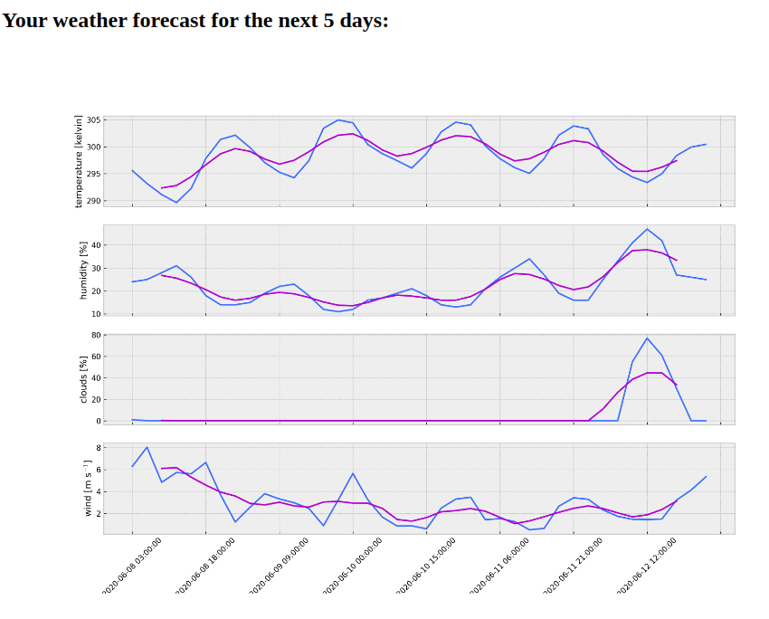
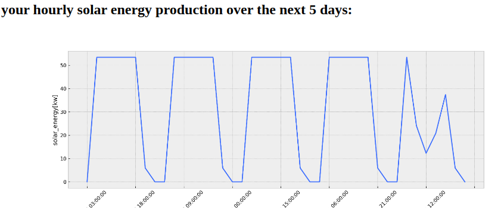

# Forecasting Solar Energy production for a U.S. house

## Introduction and problem statement 

  
renewable energy usage is increasing with a very high pace in the United states. one type of renewable energy that is being used very much is solar energy. there are many incentives provided from the government that encourage people to use solar energy. This energy usage can lead to many problems that need to be solved. One problem is the grid stability, when there is a huge solar energy production that is being fed to the main grid, the grid will be unstable. So it is very important for the energy provider companies to be aware of this extra energy. Being aware of the extra energy can help them to plan ahead. Also it is important for the people to be aware of their energy production. Solar panel installation companies are also eager to know which areas produce less solar energy so those areas can be a good market for them. All of these reasons show that it is very important to forecast solar energy production.
One way that is proposed  in this project to forecast solar energy production is using the object detection and weather forecast.The project is consisting of three main parts.  

---
## Object Detection Model (Yolov3)

The first part is training the object detection model as follows:
   1. About 500 colored images are collected manually using the google satellite map from top of the U.S. houses in different states.
   2. The images are labeled by drawing bounding boxes around the objects of our interest using the LabelImg.
   3. Three classes are defined to be detected in the images. Solar panels, cars and swimming pools.
   4. The images are preprocessed using Robowflow.ai. The preprocess step includes making all the images same size (416*416) and discarding EXIF rotations.
   5. The preprocessed images are split to three parts. train , validation and test.
   6. The train images are fed to an object detection model to train the model.
   7. The object detection model that is being used is a pytorch Yolov3 model provided by Ultralytics.com. 
   8. The model is evaluated after training and applied to the test images to see the results.

Here you can see the output of the model for some of the test images:

---

## Weather Forecast

The second part of the project is using different APIs to find a good weather forecast. As follows:
   1. Google map geocode api is used to find the latitude and longitude of the user’s address.
   2. The lat and long of the user’s address is used to find the weather forecast of the user’s location.
   3. The weather forecast is coming from the weather api that provides the weather forecast parameters like temperature, humidity, cloud coverage and wind speed for the next five days every 3 hours.
Here is an example for weather forecast for a house in texas:

---

## Solar Energy Forecast
The third part of the project is to use the object detection model output in combination with weather forecast data to give a solar energy forecast for the next five days as follows:
   1. The output of the object detection model identifies the solar panels and their counts in the satellite image.
   2. Almost all the solar panels are produced in standard sizes.
   3. A rule of thumb says that 
   4. The output of the object detection model gives us the total area of the solar panels on top of the roof.
   5. Based on the area of the solar panels and the cloud coverage of the user’s location a forecast for the solar energy production is given for the next five days.

---

## Flask App

To show every steps in a complete way that all the users can understand a Flask app is created. In the next part all the steps are done using the Flask app. 
The users can enter their address in the postal address bar:
This is an example from a house in Los Angeles.

Then they can import their satellite image from top of their house and click submit.

After submitting the data the flask app shows them different plots. The first plot is their location which is specified by the red triangles. 

The second plot is their weather forecast parameters for the next five days like temperature, wind and clouds.

The third plot is their original satellite image and the object detection output that shows the identified solar panels on their roof.

the last plot shows them their solar energy production for the next five days based on the area of the solar panels identified by the model and the cloud coverage.

---

## Conclusion

This model can be used to give a solar energy forecast for the next five days which is a very important thing for energy provider companies. Yolov3 is used to develope an object detection model that predicts the solar panels from satellite images.the model is used to forecast solar energy production in combination with weather data. the object detection model accuracy is 0.93. the model can be improved by using semantic segmentation to find the solar panels in satellite images.    

